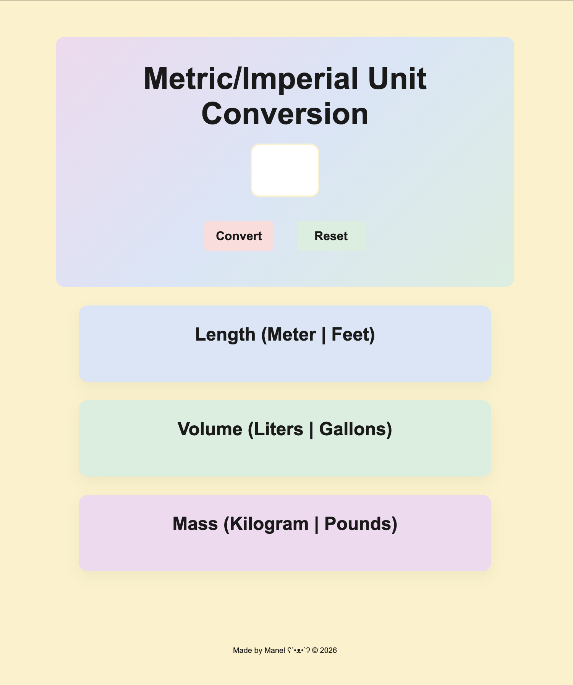
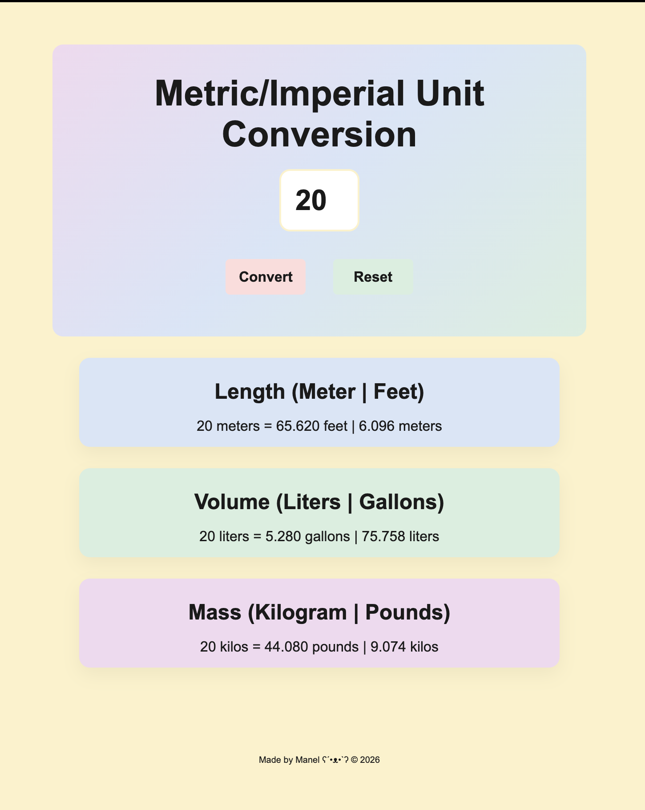

# Unit Conversion Application

This is a unit conversion application that allows user to enter a number and it will calculate the length, volume and mass both in imperial and metrics quantity upon clicking on the convert button. The reset button will reset all the fields.

---

## The Interface

  

---

## Built With
- HTML5 
- CSS3
- JavaScript
- Cursor
---

## What I learnt 
- Round number according to chosen number of decimals - tofixed() method
- Reload the content of the page on click - window.location.reload();

